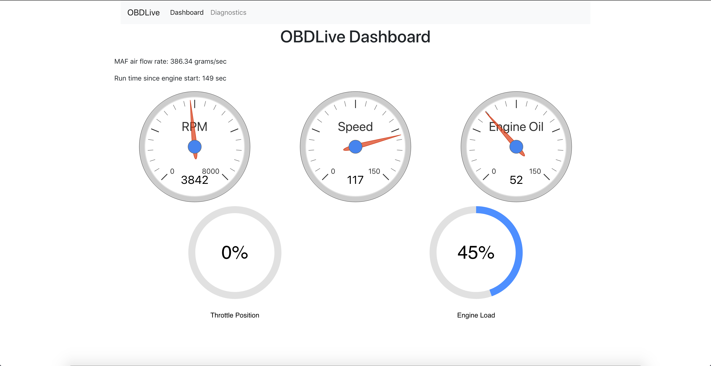
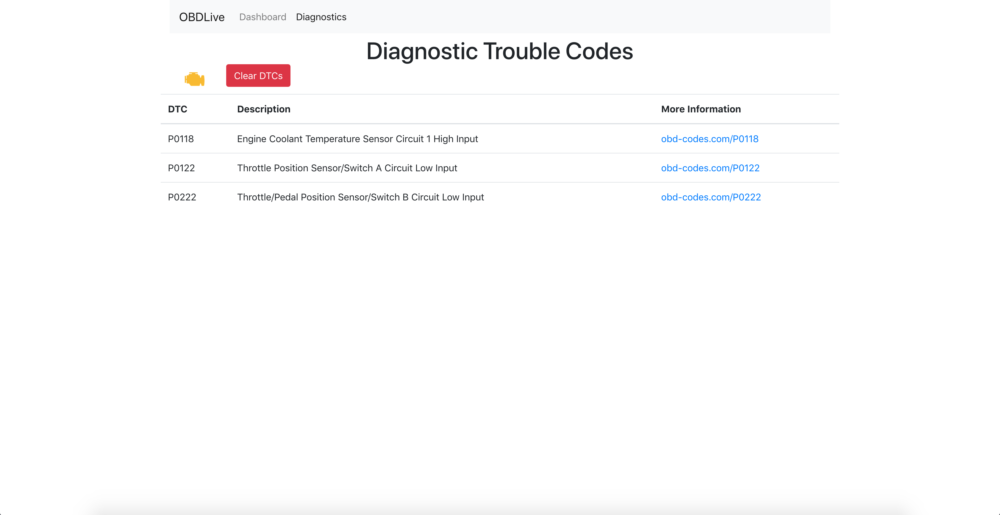

# OBDLive
OBDLive is a tool that uses a Raspberry Pi, PICAN2 board, and OBD-II cable to interface with a vehicle's CAN bus and visualize diagnostic data in real time. The tool can visualize data such as vehicle speed, RPM, and mass air flow rate, as well as read and reset diagnostic trouble codes (DTCs).

## About the Project
This repository is the culmination of my research and final product in the Independent Study Mentorship (ISM) class that I took my senior year of high school. In short, I spent the first semester researching security in general, honing in on automobile security, and ultimately learning about CAN and the OBD-II diagnostic system on modern vehicles, and I spent the second semester developing the code which is hosted in this repo along with a presentation I gave at the local school district administration building.

There are two sections to the project: the code that runs on the Raspberry Pi itself, and the client/visualizer Django app that  runs on another device (a personal computer). These are located in the `pi` and `obdlive` directiories respectively.

## pi
The code that runs on the Raspberry Pi is rather simple: its sole purpose is to receive OBD-II PIDs from a client and respond with the data on the vehicle's CAN bus. In order to do this, you need:
* [PICAN2 board](https://copperhilltech.com/pican-2-can-interface-for-raspberry-pi-2-3/)
* [SocketCAN](https://copperhilltech.com/pican2-controller-area-network-can-interface-for-raspberry-pi/)
* [OBD-II cable](https://copperhilltech.com/obd2-j1962-16pin-cable-open-end/)

Make sure to set the expected baud rate in `canup.sh`. Then, simply ssh into the pi and run `./canup.sh && ./server` after connecting the PICAN2 board to the OBD-II port in a vehicle.

## obdlive
Once everything on the Pi is up and running, the Django app should start up with `python manage.py runserver`. Be sure that the device on which the Django app is running is on the same network as the Raspberry Pi. Change the IP address in `obdlive/obd/obdport.py` to that of the Raspberry Pi on the local network.
